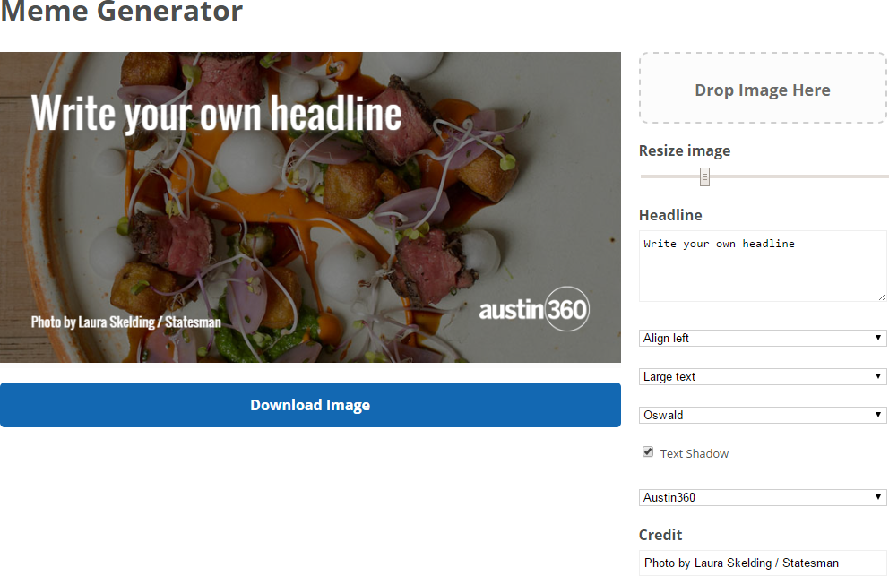

# Omaha.com social media share images generator

A direct clone of the [Austin American Statesman's meme generator](https://github.com/statesman/meme) which is a lightly-modified fork of the [Vox meme generator](https://github.com/voxmedia/meme). They say it has been modified to work without Ruby (except Compass, which is required to run the build process).

That it's working here at all is something of a miracle.

All of this stuff is from the glorious people at statesman.com: 

## Deploying

Statesman images, fonts, etc. are currently in the app so you'll need to follow the steps below to customize the app for your use:

1. Edit the settings file at `source/javascripts/settings.js`.
2. Add any fonts you'll need at `source/stylesheets/_fonts.scss`.
3. `npm install`
4. `gem install compass`
4. Run `grunt`
5. *Optional:* Deploy to [GitHub pages](https://pages.github.com/) with `git push origin master:gh-pages`.
6. Open the `index.html` file (or your GitHub pages URL) in your browser and meme away.

See the original repo at https://github.com/voxmedia/meme for additional info.
